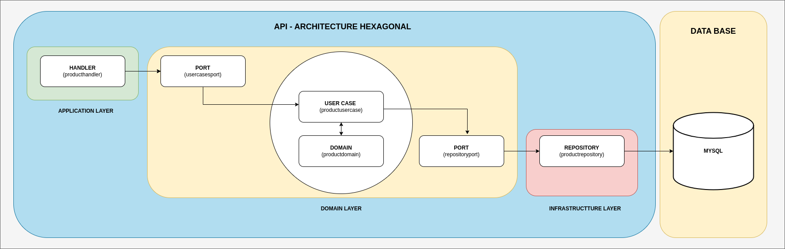

# Project to learn Golang, for this, I created a crud of the product.

This project isn't the object be a commercial application. 

## 🚀 Starting

The principal objective of this project is to show how the use Golang on a hexagonal architecture. 

## 🛠 Stack

<ol>
  <li>Golang</li>
  <li>VsCode</li>
  <li>Postman</li>
  <li>Mysql</li>
  <li>Mysql Workbench</li>
  <li>Docker</li>
</ol>

## ⚙️ Architecture

## ⚙️ Structure

## ⚙️ Data Base

## ⚙️ Creating a Database on MySQL.

~~~~sql
CREATE DATABASE `db_products`;
~~~~

## ⚙️ Creating a Table on Databsse.

~~~~sql
CREATE TABLE IF NOT EXISTS tb_product(
   `id` 		   INT NOT NULL PRIMARY KEY AUTO_INCREMENT,
   `description`   VARCHAR(100) NOT NULL,
   `price`   	   FLOAT NOT NULL,
   `total`   	   INT NOT NULL,
   `created`   	   timestamp NOT NULL
);
~~~~

## ⚙️ Download the dependencies.

~~~~shell
go mod tidy
~~~~

## ⚙️ Executing the project.

~~~~shell
 go run cmd/main.go
~~~~

go install github.com/swaggo/swag/cmd/swag@latest

vi ~/.profile 

export PATH=$(go env GOPATH)/bin:$PATH

source ~/.profile 

swag init

//create swagger docs

swag init -g cmd/main.go 

Docs

https://github.com/swaggo/http-swagger

swag init -g cmd/main.go handlers/producthandler/producthandler.go 
